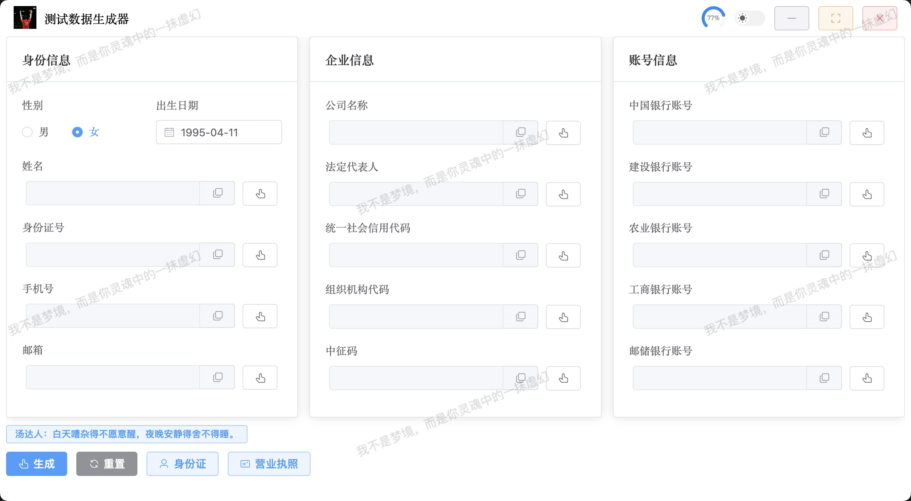
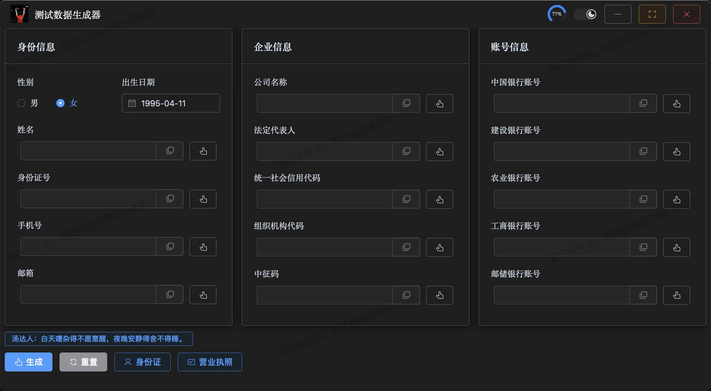

# testdata-generator-tool

一个用于生成各类号码的工具。

## 项目结构

```
testdata-generator-tool/
├── assets/ # 资源文件目录
│ ├── fonts/ # 字体文件目录
│ │ ├── hei.ttf # 黑体字体
│ │ ├── ocrb10bt.ttf # OCR-B字体
│ │ └── fzhei.ttf # 仿宋字体
│ ├── images/ # 图片资源目录
│ │ ├── business_license.png # 营业执照模板
│ │ ├── empty.png # 空白身份证模板
│ │ ├── liuyf.jpg # 女神刘亦菲
│ │ └── pengyy.jpeg # 男神彭于晏
│ ├── areaCode.txt # 地区编码数据
│ ├── ico.icns # Mac应用图标
│ └── ico.ico # Windows应用图标
├── backend/ # 后端python目录
│ ├── config/ # 配置文件目录
│ │ ├── init.py # 包初始化文件
│ │ ├── config_manager.py # 配置管理器
│ │ └── constants.py # 常量配置
│ ├── init.py # 包初始化文件
│ └── gen.py # 数据生成工具类
├── gui/ # 前端Vue页面目录
├── images/ # 效果图目录
└── main.py # 主程序文件
```

## 效果图展示
### vue版(pywebview分支)

---


## Python 库安装

```python
# 剪切板
pip install pyperclip
# 图像处理
pip install opencv-python
pip install Pillow
# 数组计算
pip install numpy
# 接口（vue版需要）
pip install axios
# webview支持（vue版需要）
pip install pywebview
```

## 运行程序

```python
# 直接命令窗口中执行以下命令即可
python main.py
```

## 打包程序

- 安装 pyinstaller

  ```python
  pip install pyinstaller
  ```

- Mac 打包

  ```python
  pyinstaller -i asserts/ico.icns --name 测试数据生成器 --windowed --clean --noconfirm --onefile --add-data ./asserts:./asserts main.py
  ```

- Windows 打包

  ```python
  pyinstaller -i asserts/ico.ico --name 测试数据生成器 --windowed --clean --noconfirm --onefile --add-data "asserts;asserts" main.py
  ```
