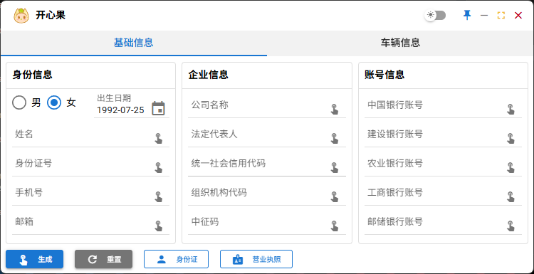
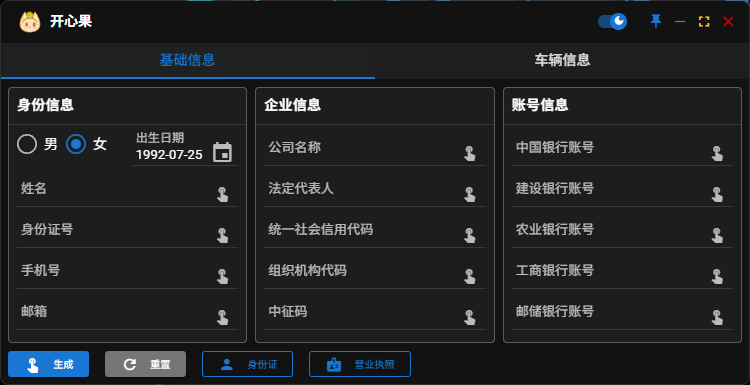

# 开心果

一个用于生成各类测试数据的工具。

## 项目结构

```
testdata-generator-tool/
├── src/                               # 源码目录
│   ├── generators/                    # 数据生成器模块
│   │   ├── __init__.py                # 模块导出
│   │   ├── data_generator.py          # 生成器基类
│   │   ├── id_generator.py            # 身份证生成器
│   │   ├── phone_generator.py         # 手机号/邮箱生成器
│   │   ├── company_generator.py       # 公司信息生成器
│   │   ├── bank_generator.py          # 银行卡生成器
│   │   ├── vehicle_generator.py       # 车辆信息生成器
│   │   └── personal_generator.py      # 个人信息生成器
│   ├── services/                      # 服务模块
│   │   ├── __init__.py                # 模块导出
│   │   ├── image_service.py           # 图片生成服务
│   │   └── path_service.py            # 路径服务
│   ├── configs/                       # 配置模块
│   │   ├── __init__.py                # 模块导出
│   │   ├── config_manager.py          # 配置管理器
│   │   └── constants.py               # 常量配置
│   ├── utils/                         # 工具模块
│   │   ├── __init__.py                # 模块导出
│   │   ├── api.py                     # API接口
│   │   ├── cache_manager.py           # 缓存管理
│   │   └── logger.py                  # 日志配置
│   └── __init__.py                    # 源码模块导出
├── tests/                             # 测试目录
│   ├── __init__.py
│   └── test_generators.py             # 生成器测试
├── assets/                            # 资源文件目录
│   ├── fonts/                         # 字体文件目录
│   │   ├── hei.ttf                    # 黑体字体
│   │   ├── ocrb10bt.ttf               # OCR-B字体
│   │   └── fzhei.ttf                  # 仿宋字体
│   ├── images/                        # 图片资源目录
│   │   ├── business_license.png       # 营业执照模板
│   │   ├── empty.png                  # 空白身份证模板
│   │   ├── liuyf.jpg                  # 女性头像
│   │   └── pengyy.jpeg                # 男性头像
│   ├── areaCode.txt                   # 地区编码数据
│   ├── ico.icns                       # Mac应用图标
│   ├── logo.ico                       # Windows应用图标
├── gui/                               # 前端Vue项目目录
│   ├── src/                           # Vue源码目录
│   │   ├── api/                       # API封装
│   │   ├── components/                # Vue组件目录
│   │   ├── composables/               # 组合式函数
│   │   ├── stores/                    # Pinia状态管理
│   │   ├── views/                     # 页面组件目录
│   │   ├── assets/                    # 前端资源文件
│   │   ├── router/                    # 路由配置
│   │   ├── App.vue                    # 根组件
│   │   └── main.js                    # 入口文件
│   ├── package.json                   # 前端依赖配置
│   └── vite.config.js                 # Vite构建配置
├── images/                            # 效果图目录
├── main.py                            # 主程序入口文件
├── requirements.txt                   # Python依赖配置
├── CONFIG.md                          # 配置说明文档
└── README.md                          # 项目说明文档
```

## 架构特性

### 🏗️ 模块化设计
- **前后端分离**: Vue 3 + Quasar 前端 + Python 后端
- **模块化架构**: 日志、API、缓存管理等功能独立模块

### 🔧 核心功能
- **数据生成**: 身份证、手机号、邮箱、公司名称、车辆信息等各类测试数据
- **图片生成**: 身份证、营业执照等证件图片生成
- **缓存管理**: 智能缓存清理和管理
- **日志系统**: 完善的日志记录和轮转机制
- **窗口控制**: 置顶、缩放、深色模式等

### ⚙️ 配置管理
程序支持灵活的配置选项，详见 [CONFIG.md](CONFIG.md)：
- 日志文件位置配置
- 缓存清理策略配置
- 开发/生产环境适配

## 效果图展示

---


## 环境依赖

### Python 依赖
```bash
pip install -r requirements.txt
```

### 前端依赖 (仅开发时需要)
```bash
cd gui
npm install
```

### 前端主要依赖包
- **Vue 3**: 前端框架
- **Quasar**: UI组件库
- **Pinia**: 状态管理
- **Vite**: 构建工具

## 运行程序

### 直接运行
```bash
python main.py
```

### 开发模式
```bash
# 1. 安装前端依赖
cd gui
npm install

# 2. 开发模式运行前端 (可选)
npm run dev

# 3. 构建前端
npm run build

# 4. 返回根目录运行主程序
cd ..
python main.py
```

## 打包程序

### 准备工作
```bash
cd gui && npm run build && cd ..
pip install pyinstaller
```

### 打包命令

#### 普通环境

**Windows**
```bash
pyinstaller -i assets/logo.ico --name 开心果 --windowed --clean --noconfirm --onefile --add-data "assets;assets" --add-data "gui;gui" main.py
```

**Mac**
```bash
pyinstaller -i assets/ico.icns --name 开心果 --windowed --clean --noconfirm --onefile --add-data ./assets:./assets --add-data ./gui:./gui main.py
```

**Linux**
```bash
pyinstaller --name 开心果 --windowed --clean --noconfirm --onefile --add-data "./assets:./assets" --add-data "./gui:./gui" main.py
```

#### 虚拟环境

**Windows**
```bash
# 创建虚拟环境（如果没有）
python -m venv venv

# 激活虚拟环境
venv\Scripts\activate

# 安装依赖
pip install -r requirements.txt
pip install pyinstaller

# 构建前端并打包
cd gui && npm run build && cd ..
venv\Scripts\pyinstaller.exe -i assets/logo.ico --name 开心果 --windowed --clean --noconfirm --onefile --add-data "assets;assets" --add-data "gui;gui" main.py
```

**Mac/Linux**
```bash
# 创建虚拟环境（如果没有）
python3 -m venv venv

# 激活虚拟环境
source venv/bin/activate

# 安装依赖
pip install -r requirements.txt
pip install pyinstaller

# 构建前端并打包
cd gui && npm run build && cd ..
pyinstaller -i assets/ico.icns --name 开心果 --windowed --clean --noconfirm --onefile --add-data ./assets:./assets --add-data ./gui:./gui main.py
```

